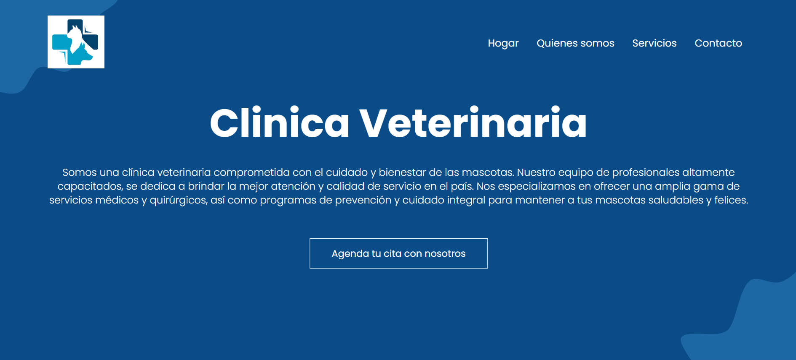
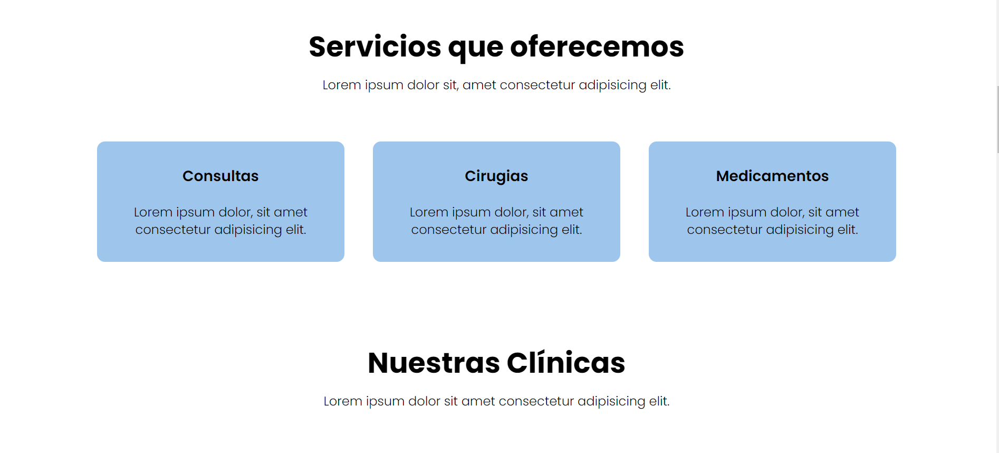

# UNP Veterinary Clinic

This project is a website for a veterinary clinic where customers can get information about the services offered, contact the clinic, and schedule appointments through an online form.

## Features

- Detailed information about the veterinary clinic and the services provided.
- Online form for customers to schedule appointments.
- Responsive design that adapts to different devices.
- Use of web technologies like HTML, CSS, and JavaScript. (currently in progress of using javaScript)

## Project Content

The repository contains the following files and folders:

- `index.html`: Main page of the veterinary clinic.
- `form.html`: Online form for scheduling appointments.
- `style.css`: CSS style sheet for the page design.
- `images` folder: Contains the images used in the project.

## Screenshots

Here are some screenshots of the website:

## Contributions

Contributions to this project are welcome. If you would like to contribute, you can do so by following these steps:

1. Fork the repository.
2. Create a new branch for your contribution.
3. Make your changes and improvements.
4. Submit a pull request for review.

## Contact

If you have any questions or suggestions, feel free to contact me at ufernando769@gmail.com

I hope you enjoy our project.
